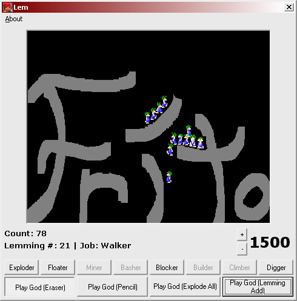



## Kill Lemmings Demo With High Resolution Timers

### Description

This is a demo program showing how someone could make a lemmings type game. This code uses bitblt with high resolution timers and is quite fast. Note: I do not have any affiliation with the creators of the game Lemmings, nor is this program complete, I just made it for fun.

CCRP Timers are included.
 
### More Info
 
Must install ccrp timer activex control. See http:www.mvps.org/ccrp/

Slow computers could crash.

             |
---                |---
**Submitted On**   |2001-12-17 22:42:28
**By**             |[Peter Rosconi](https://github.com/Planet-Source-Code/PSCIndex/blob/master/ByAuthor/peter-rosconi.md)
**Level**          |Advanced
**User Rating**    |5.0 (15 globes from 3 users)
**Compatibility**  |VB 6\.0
**Category**       |[Games](https://github.com/Planet-Source-Code/PSCIndex/blob/master/ByCategory/games__1-38.md)
**World**          |[Visual Basic](https://github.com/Planet-Source-Code/PSCIndex/blob/master/ByWorld/visual-basic.md)
**Archive File**   |[Kill\_Lemmi4278012172001\.zip](https://github.com/Planet-Source-Code/peter-rosconi-kill-lemmings-demo-with-high-resolution-timers__1-29904/archive/master.zip)

